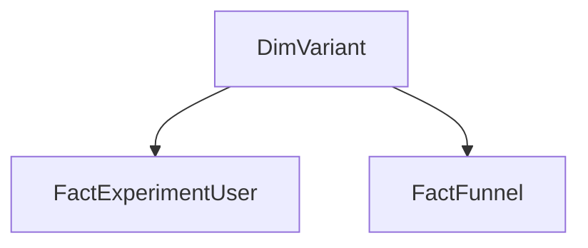

# Power BI Executive Reporting Layer — Checkout A/B Test

## Purpose

This reporting layer presents the checkout experiment as a one-page executive decision dashboard in Power BI. It uses the same mature exposed-user population, ordered event attribution, metric denominators, statistical test, and product recommendation as the source analysis and Tableau reporting layer.

The Power BI implementation emphasizes a reusable semantic model, explicit DAX measures, consistent variant filtering, and a compact 1920 × 1080 decision layout. It is not intended as a pixel-level copy of the Tableau dashboard.

## Source Tables

| Model table | Source | Grain | Purpose |
|---|---|---|---|
| `FactExperimentUser` | [`tableau_user_metrics.csv`](../data/processed/tableau_user_metrics.csv) | One row per mature exposed user | Population, conversion, device, retained revenue, and guardrails |
| `FactFunnel` | [`tableau_funnel_summary.csv`](../data/processed/tableau_funnel_summary.csv) | One row per experiment group and ordered funnel step | Cumulative checkout funnel |
| `DimVariant` | DAX calculated table | One row per experiment variant | Shared Control/Treatment labels and sort order |

The two fact tables remain separate because they have different grains. `DimVariant` filters both facts through one-to-many, single-direction relationships. Guardrails are defined as explicit measures and displayed together in a compact comparison matrix.

## Data Connections

The report imports the two versioned CSV files from the public analysis repository. The model renames the imported queries to the neutral business-facing names above. The PBIX therefore contains no machine-specific local path and can refresh without access to the author's Windows directory.

The frozen processed-data source commit is `7b69e52a362da5232b7e029c56db165b38fb51ef`.

## Measure Catalog

[`checkout_ab_test_measures.dax`](checkout_ab_test_measures.dax) contains the complete calculated-table and measure definitions. [`checkout_ab_test_measure_loader.dax`](checkout_ab_test_measure_loader.dax) provides an executable DAX Query View definition and validation query. After validation, [`checkout_ab_test_model.tmdl`](checkout_ab_test_model.tmdl) creates the model measures, descriptions, display folders, hidden supporting measures, and numeric formats as one controlled metadata update. The primary test uses a pooled null standard error; the confidence interval uses an unpooled risk-difference standard error. Guardrail measures retain their metric-specific denominators.

[`validate_powerbi_data.mjs`](validate_powerbi_data.mjs) independently verifies processed-data grain and the frozen conversion, funnel, device, retained-revenue, and guardrail outputs.

Expected validated results:

| Metric | Control | Treatment | Difference |
|---|---:|---:|---:|
| Mature exposed users | 7,754 | 7,713 | — |
| Purchase conversion | 27.47% | 29.63% | +2.16 pp |
| Retained revenue per exposed user | $24.52 | $26.33 | +$1.81 |
| Payment failure | 5.36% | 5.13% | -0.23 pp |
| Checkout error | 3.07% | 3.49% | +0.42 pp |
| Refund / cancellation | 5.68% | 6.48% | +0.80 pp |

The two-sided primary p-value is `0.0030`, and the 95% confidence interval for absolute lift is `+0.73 to +3.58 pp`.

## Report Design

- **Canvas:** 1920 × 1080 executive report page
- **Control:** neutral gray (`#6B7280`)
- **Treatment:** deep blue (`#2563EB`)
- **Caution state:** amber (`#F59E0B`)
- **Positive supporting result:** green (`#059669`)
- **Primary text:** near-black (`#111827`)
- **Page background:** off-white (`#F7F8FA`)

The custom report theme is stored in [`checkout_ab_test_theme.json`](checkout_ab_test_theme.json).

The one-page report contains:

1. Experiment context and variant legend
2. Control and treatment conversion, absolute lift, and statistical confidence
3. Ordered checkout-funnel comparison
4. Purchase conversion by exposure device
5. Retained revenue per exposed user
6. Payment-failure, checkout-error, and refund/cancellation guardrails
7. Product recommendation: **Need more data before full launch**

No slicer is required for the executive view. Each visual answers a defined decision question, and all variant comparisons preserve the same Control/Treatment color mapping.

The presentation-layer PBIX and recruiter-facing screenshot are maintained in the separate [dashboard portfolio repository](https://github.com/yg3072-debug/analytics-dashboard-portfolio/tree/main/powerbi). The analysis repository retains the reproducible data layer, model specification, measures, and report theme.

## Interpretation Standard

The statistically significant conversion gain and higher retained revenue support continued investment in the simplified checkout. They do not establish that checkout error and refund/cancellation risks are acceptably small. The recommended next step is a confirmatory extension with pre-specified non-inferiority margins for those guardrails rather than an immediate full launch.
